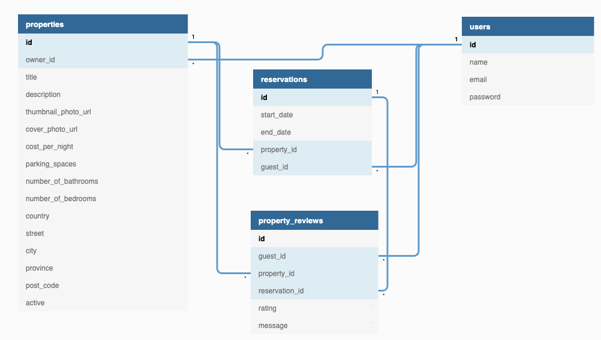
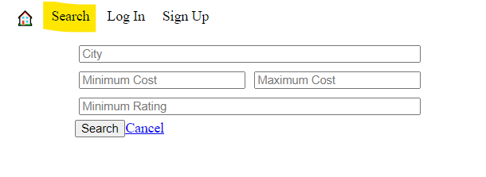
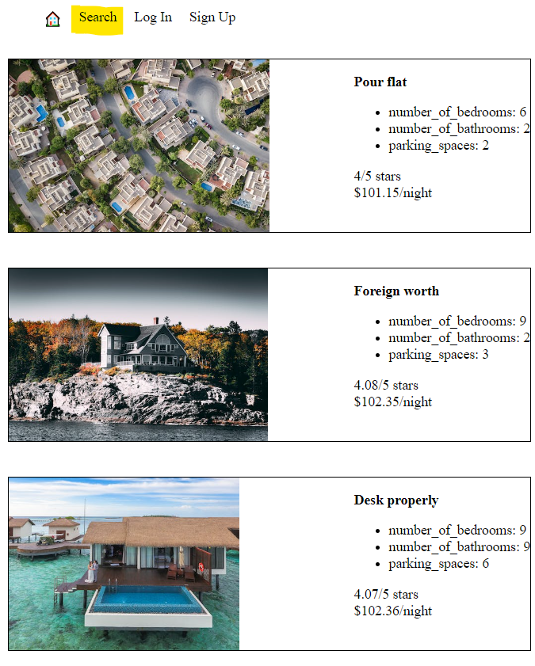
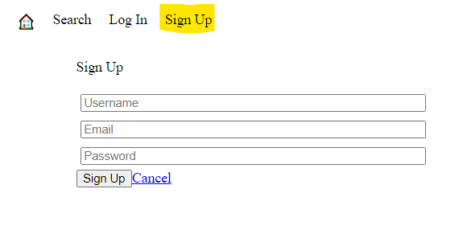
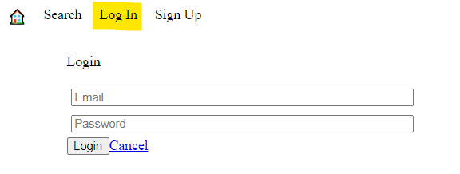
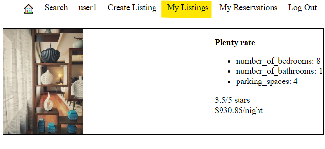
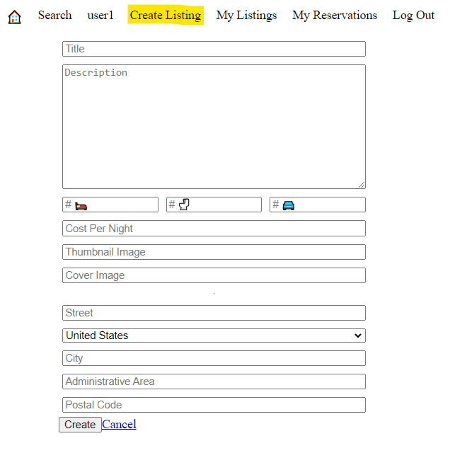
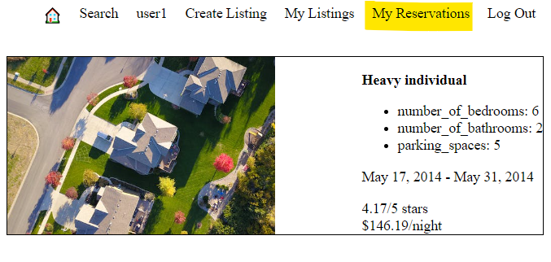

# :curly_loop:Lightbnb - A place like home, away from home :tent:

# About LightBnB:curly_loop:
If you're a passionate traveler but seeking comfort and cleanliness of home then Lightbnb is an app for you! 
Its a convenient little app providing homeowners with the option to rent out their homes to _vacationers_, offering a refreshing alternative to traditional hotels and bed and breakfasts!
With this app, users can login and find properties based on different search filters, access the property information, make reservations, manage their bookings, and provide feedback through reviews! 
<sub>A complete app to enhance your travel experience!</sub>

## LightBnB Project
This project is made by :raising_hand_woman: [Madiha Waqar](https://www.linkedin.com/in/madiha-waqar-a8253827) as part of Lighthouse Labs Web Development Flex Program curriculum. 

## Tech Stack
LightBnB is _full-stack application_ that uses `PostgreSQL` relational database system and `Express` to manage the backend. Front-end has already been provided by Lighthouse labs which uses `HTML, CSS3, SASS and Javascript`. Front-end boilterplate code has been forked from [LightBnB_WebApp](https://github.com/lighthouse-labs/LightBnB_WebApp)
<p align="center">
  <a href="https://skillicons.dev">
    
  </a>
</p>
<p align="center">
  <a href="https://skillicons.dev">
    
  </a>
</p>

## :traffic_light: Dependencies
  ```
    "bcrypt": "^3.0.6",
    "cookie-session": "^1.3.3",
    "dotenv": "^16.3.1",
    "express": "^4.17.1",
    "nodemon": "^1.19.1",
    "pg": "^8.11.1"
  ```

## :seedling: ERD


## :nut_and_bolt: Project Structure
* `db` contains all the database interaction code.
  * `json` is a directory that contains a bunch of dummy data in `.json` files.
  * `database.js` is responsible for all queries to the database. It doesn't currently connect to any database, all it does is return data from `.json` files.
* `public` contains all of the HTML, CSS, and client side JavaScript. 
  * `index.html` is the entry point to the application. It's the only html page because this is a single page application.
  * `javascript` contains all of the client side javascript files.
    * `index.js` starts up the application by rendering the listings.
    * `network.js` manages all ajax requests to the server.
    * `views_manager.js` manages which components appear on screen.
    * `components` contains all of the individual html components. They are all created using jQuery.
* `routes` contains the router files which are responsible for any HTTP requests to `/users/something` or `/api/something`. 
* `styles` contains all of the sass files. 
* `server.js` is the entry point to the application. This connects the routes to the database.

## :triangular_flag_on_post: Getting Started

Clone the remote repo to a folder named lightbnb
## Database Setup

  - `cd lightbnb`
  - Start the PostgreSQL server by using the `psql` command in terminal
  - Create the lightbnb db using `CREATE DATABASE lightbnb`
  - Connect to the db using `\c lightbnb`
  - Add tables to the db using `\i migrations/01_schema.sql`
  - Add seed data using `\i seeds/02_seeds.sql`
  - Database connection configurations are stored in `.env` file

## Application Setup & Features

- `cd LightBnB_WebApp` and install dependencies using the `npm install i` command
- Start the web server using the `npm run local` command. 
- The app will be served at http://localhost:3000
- If you're having trouble, you may need to have npx installed `npm install -g npx`

## :dart: Features
- Properties from the seed data can be searched using optional query parameters via the search link.
- User can log in by providing email address from the seed data and using password _password_
- Once logged in, a new listing can be added with the Create Listing link
- On loggin, user can access his existing reservations and owner can access listed properties
- New users can be added by clicking the Sign Up link

## :books: [database.sql](./db/database.js)
- **Users**
  - getUserWithEmail
  - getUserWithId
  - addUser
- **Reservation**
  - getAllReservations
- **Properties**
  - getAllProperties
  - addProperty
  
## App Screenshots
- Search Filters



- Search Filter Results



- Add New User



- Existing User Login With Email



- Users Existing Listings



- User Can Create New Listings



- Users Can View Existing Reservations



## :fire: Enjoy
Thank you for taking the time to explore `LightBnB`! I hope that you enjoyed my take on this useful app. Feel free to dive in and check all implemented features!

------------------------------------------------------------------------------------------------